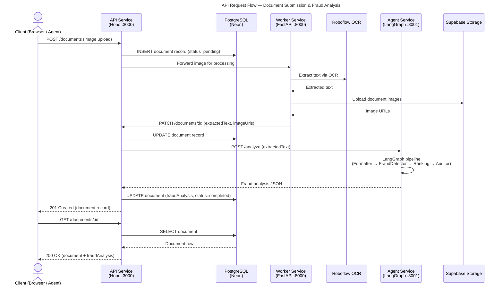

# API Documentation — Medcurial AI Claims Fraud Detection

---

## 1. API Overview

The Medcurial AI Claims Fraud Detection REST API is a TypeScript service built with **Bun** and **Hono**. It is the single entry point for all client interactions: signature management, document processing, review workflows, chat sessions, and user management.

| Property | Value |
|----------|-------|
| Base URL (local) | `http://localhost:3000` |
| Protocol | HTTP/1.1 |
| Data format | JSON (`application/json`) |
| Authentication | Session token (cookie or `Authorization` header) |
| API version | v1 (no prefix — current) |

---

## 2. Authentication

The API uses **Better Auth** for session management. Users authenticate with email and password. A session token is issued on successful login and must accompany every subsequent request.

### Login

```http
POST /api/auth/sign-in/email
Content-Type: application/json

{
  "email": "reviewer@example.com",
  "password": "SecurePass123!"
}
```

**Response (200)**

```json
{
  "token": "<session-token>",
  "user": {
    "id": "abc123",
    "name": "Jane Reviewer",
    "email": "reviewer@example.com",
    "role": "user"
  }
}
```

### Passing the Token

Include the session token in the `Authorization` header for all protected endpoints:

```http
Authorization: Bearer <session-token>
```

---

## 3. Endpoints

### 3.1 Signature Endpoints

Base path: `/signatures`

| Method | Path | Description | Auth |
|--------|------|-------------|------|
| `GET` | `/signatures` | List all signatures | ✅ |
| `GET` | `/signatures/:id` | Get a signature by ID | ✅ |
| `POST` | `/signatures` | Create a new signature record | ✅ |
| `PUT` | `/signatures/:id` | Update a signature record | ✅ |
| `DELETE` | `/signatures/:id` | Delete a signature record | ✅ |

---

### 3.2 Document Endpoints

Base path: `/documents`

| Method | Path | Description | Auth |
|--------|------|-------------|------|
| `GET` | `/documents` | List documents (supports filters) | ✅ |
| `GET` | `/documents/:id` | Get a document by ID | ✅ |
| `POST` | `/documents` | Create a new document record | ✅ |
| `PUT` | `/documents/:id` | Update a document record | ✅ |
| `DELETE` | `/documents/:id` | Delete a document record | ✅ |
| `PATCH` | `/documents/:id/approve` | Approve or reject a document (CAP) | ✅ |
| `POST` | `/documents/:id/findings` | Add a review finding to a document | ✅ |

---

### 3.3 Chat Endpoints

Base path: `/chat`

| Method | Path | Description | Auth |
|--------|------|-------------|------|
| `GET` | `/chat/sessions` | List all chat sessions for the user | ✅ |
| `GET` | `/chat/sessions/:id` | Get a chat session and its messages | ✅ |
| `POST` | `/chat/sessions` | Create a new chat session | ✅ |
| `DELETE` | `/chat/sessions/:id` | Delete a chat session | ✅ |
| `GET` | `/chat/sessions/:id/messages` | List messages in a session | ✅ |
| `POST` | `/chat/sessions/:id/messages` | Post a message to a session | ✅ |

---

### 3.4 User Endpoints

Base path: `/users`

| Method | Path | Description | Auth |
|--------|------|-------------|------|
| `GET` | `/users/me` | Get current authenticated user | ✅ |
| `PATCH` | `/users/me` | Update current user profile | ✅ |

Auth routes are handled by Better Auth under `/api/auth/*`.

---

## 4. Request / Response Examples

### 4.1 Create Signature

```http
POST /signatures
Authorization: Bearer <token>
Content-Type: application/json

{
  "name": "John Doe",
  "imageUrls": {
    "original": [],
    "roi": [],
    "normalized": [],
    "siamese": [],
    "image_preview": []
  },
  "status": "pending"
}
```

**Response (201)**

```json
{
  "id": "abc123xyz",
  "name": "John Doe",
  "imageUrls": {
    "original": [],
    "roi": [],
    "normalized": [],
    "siamese": [],
    "image_preview": []
  },
  "status": "pending",
  "createdAt": "2026-03-31T08:00:00.000Z",
  "updatedAt": "2026-03-31T08:00:00.000Z"
}
```

---

### 4.2 Get Document with Fraud Analysis

```http
GET /documents/doc456
Authorization: Bearer <token>
```

**Response (200)**

```json
{
  "id": "doc456",
  "name": "Claim-2026-001.pdf",
  "status": "completed",
  "imageUrls": ["https://cdn.supabase.co/..."],
  "extractedText": "Patient Name: John Doe...",
  "fraudAnalysis": {
    "is_fraud": true,
    "confidence": 0.87,
    "risk_level": "high",
    "findings": ["Duplicate claim number detected", "Mismatched signature"],
    "summary": "This document exhibits multiple high-risk fraud indicators..."
  },
  "approvalStatus": "pending",
  "fiuStatus": "pending",
  "createdAt": "2026-03-31T08:00:00.000Z",
  "updatedAt": "2026-03-31T08:00:00.000Z"
}
```

---

### 4.3 Approve a Document

```http
PATCH /documents/doc456/approve
Authorization: Bearer <token>
Content-Type: application/json

{
  "action": "approve",
  "notes": "All signatures verified. Claim appears legitimate."
}
```

**Response (200)**

```json
{
  "id": "doc456",
  "approvalStatus": "approved",
  "approvalNotes": "All signatures verified. Claim appears legitimate.",
  "approvedAt": "2026-03-31T09:30:00.000Z",
  "approvedBy": "user789"
}
```

---

### 4.4 Add a Review Finding

```http
POST /documents/doc456/findings
Authorization: Bearer <token>
Content-Type: application/json

{
  "content": "Signature on page 3 does not match reference.",
  "type": "fiu",
  "status": "fraud"
}
```

**Response (201)**

```json
{
  "id": "finding001",
  "documentId": "doc456",
  "userId": "user789",
  "content": "Signature on page 3 does not match reference.",
  "type": "fiu",
  "status": "fraud",
  "createdAt": "2026-03-31T09:35:00.000Z"
}
```

---

### 4.5 Post a Chat Message

```http
POST /chat/sessions/sess123/messages
Authorization: Bearer <token>
Content-Type: application/json

{
  "role": "user",
  "content": "What are the main fraud indicators for this document?"
}
```

**Response (200)**

```json
{
  "id": "msg456",
  "sessionId": "sess123",
  "role": "assistant",
  "content": "Based on the fraud analysis, the main indicators are: 1) Duplicate claim number...",
  "createdAt": "2026-03-31T09:36:00.000Z"
}
```

---

## 5. Error Handling

All errors follow a consistent JSON shape:

```json
{
  "error": "<human-readable message>"
}
```

| HTTP Status | Meaning | Common Causes |
|-------------|---------|---------------|
| `400` | Bad Request | Missing required fields, invalid payload |
| `401` | Unauthorised | Missing or expired session token |
| `403` | Forbidden | Insufficient role permissions |
| `404` | Not Found | Resource does not exist |
| `422` | Unprocessable Entity | Validation errors (Zod schema failure) |
| `500` | Internal Server Error | Unexpected server-side error |
| `502` | Bad Gateway | Downstream service (Worker / Agent) unavailable |

### Example Error Response

```json
{
  "error": "Document not found"
}
```

---

## 6. Rate Limiting

There is no built-in rate limiting enforced at the API layer in the current release. Rate limiting should be applied at the reverse proxy / API gateway level (e.g., Nginx, Cloudflare) before reaching this service.

---

## 7. API Flow Diagram

### Diagram: Client → API → Services Request Flow



**Explanation:**

This sequence diagram shows the complete lifecycle of a document from submission to fraud analysis retrieval:

1. **Client submits a document** — The browser sends an image upload to the API.
2. **API creates a pending record** — A document row is inserted in PostgreSQL with `status=pending`.
3. **Worker processes the image** — The API forwards the image to the Worker service, which calls Roboflow for OCR and uploads processed images to Supabase.
4. **Worker updates the API** — Extracted text and image URLs are patched back onto the document record.
5. **Agent runs fraud analysis** — The API calls the Agent service, which runs the full LangGraph pipeline and returns a structured fraud report.
6. **Database is updated** — The fraud analysis JSON and final `status=completed` are persisted.
7. **Client retrieves the document** — A subsequent GET request returns the full document including the fraud analysis.
