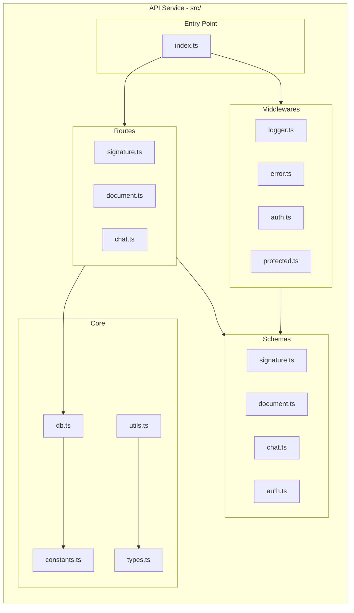
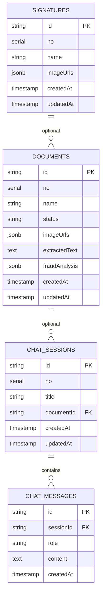
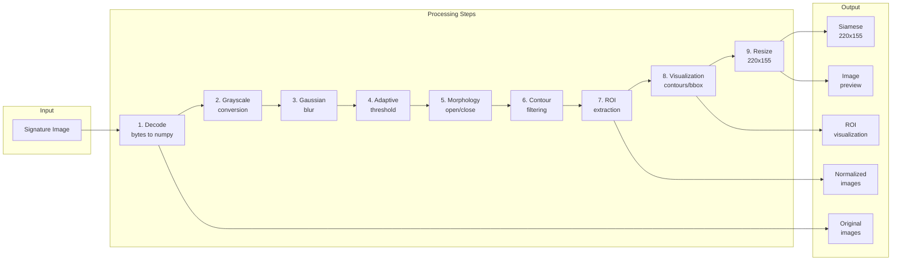
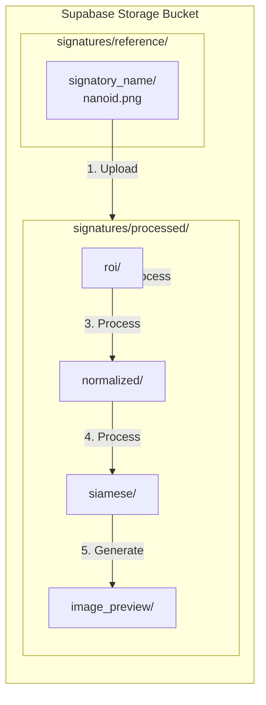
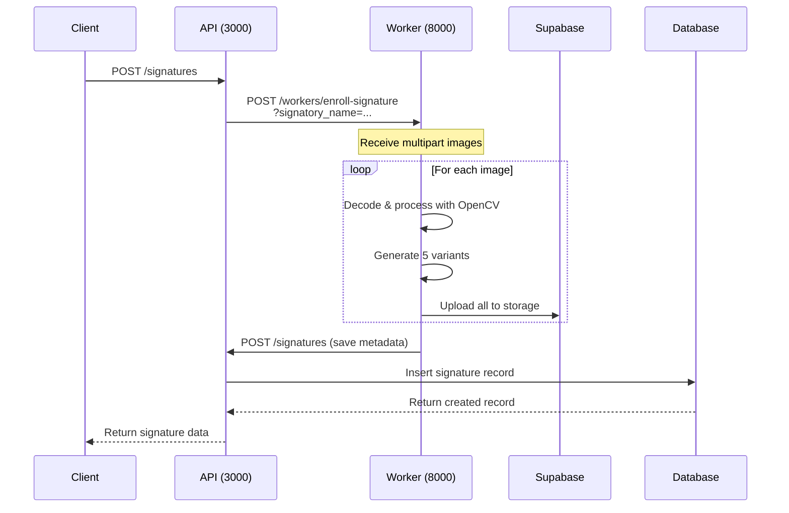
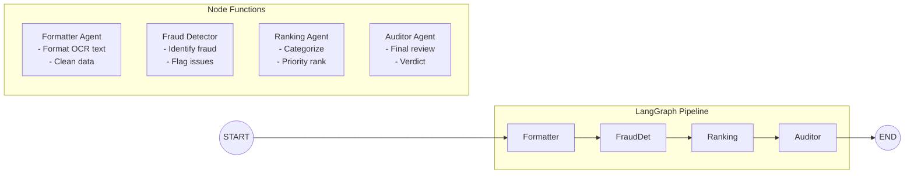
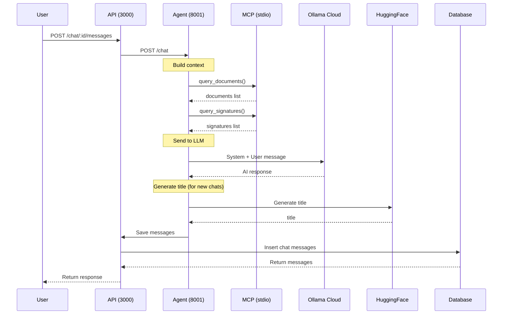
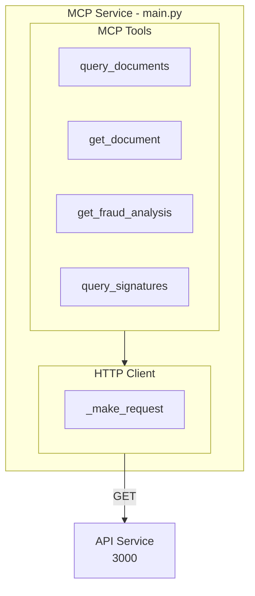
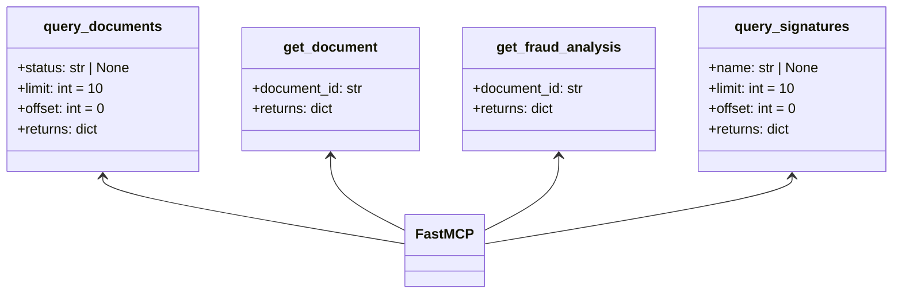
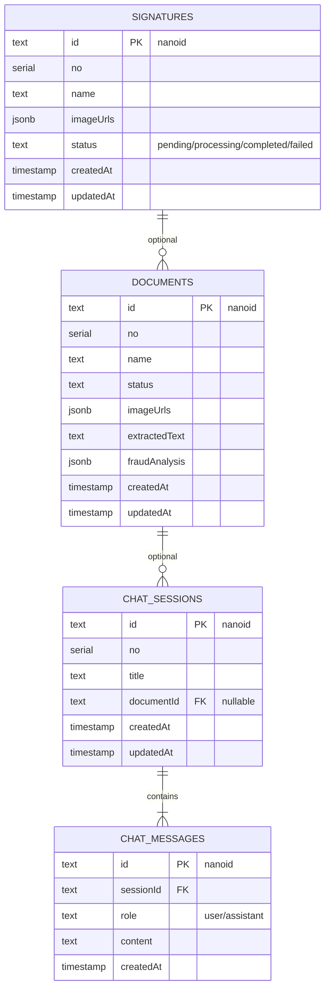

# Medcurial Architecture - Detailed Service Diagrams

## Table of Contents

1. [API Service](#api-service)
2. [Worker Service](#worker-service)
3. [Agent Service](#agent-service)
4. [MCP Service](#mcp-service)
5. [Database Schema](#database-schema)

---

## API Service

**Port:** 3000  
**Language:** TypeScript  
**Runtime:** Bun  
**Framework:** Hono + Drizzle ORM

### Components



### API Endpoints



### Route Flow

```mermaid
flowchart LR
    subgraph HTTP["HTTP Requests"]
        GET[GET]
        POST[POST]
        PUT[PUT/PATCH]
        DELETE[DELETE]
    end

    subgraph Endpoints["API Endpoints"]
        Sig[/signatures]
        Doc [/documents]
        Chat[/chat]
    end

    GET --> Sig
    POST --> Sig
    PUT --> Sig
    DELETE --> Sig

    GET --> Doc
    POST --> Doc
    PUT --> Doc
    PATCH --> Doc
    DELETE --> Doc

    GET --> Chat
    POST --> Chat
    DELETE --> Chat

    subgraph Validation["Validation Layer"]
        Zod[Zod Schemas]
        Middleware[Auth Middleware]
    end

    Sig --> Zod
    Doc --> Zod
    Chat --> Zod
    Zod --> Middleware
```

---

## Worker Service

**Port:** 8000  
**Language:** Python 3.12+  
**Framework:** FastAPI  
**Purpose:** Image processing, Supabase storage

### Components

```mermaid
flowchart TB
    subgraph Worker_Service["Worker Service - app/"]
        direction TB
        
        subgraph Entry["Entry Point"]
            Main[main.py]
        end

        subgraph Config["Configuration"]
            Config[config.py]
            Exceptions[exceptions.py]
            Deps[dependencies.py]
        end

        subgraph Routers["Routers"]
            Worker_Router[routers/worker.py]
        end

        subgraph Schemas["Schemas"]
            Worker_Schema[schemas/worker.py]
        end

        subgraph Services["Services"]
            SigProc[services/signature_processor.py]
            SigAna[services/signature_analyzer.py]
            Storage[services/storage.py]
            API_Client[services/api_client.py]
            Roboflow[services/roboflow.py]
        end
    end

    Main --> Config
    Main --> Routers
    Config --> Exceptions
    Routers --> Schemas
    Routers --> Services
    Services --> Deps
```

### Image Processing Pipeline



### Supabase Storage Structure



### API Endpoint



---

## Agent Service

**Port:** 8001  
**Language:** Python 3.12+  
**Framework:** FastAPI + LangGraph  
**Purpose:** AI fraud detection, chat assistant

### Components

```mermaid
flowchart TB
    subgraph Agent_Service["Agent Service - src/"]
        direction TB
        
        subgraph Entry["Entry Point"]
            Main[main.py]
        end

        subgraph Config["Configuration"]
            Config[config.py]
        end

        subgraph Routers["Routers"]
            Agent_Router[routers/agent.py]
            Chat_Router[routers/chat.py]
        end

        subgraph Graph["LangGraph"]
            Graph[graph.py]
            State[state.py]
            Nodes[_nodes/]
            Formatter[formatter.py]
            FraudDet[fraud_detector.py]
            Ranking[ranking.py]
            Auditor[auditor.py]
        end

        subgraph Tools["Tools"]
            Data_Tools[tools/data_tools.py]
            MCP_Client[tools/mcp_client.py]
        end

        subgraph Prompts["Prompts"]
            Prompts[prompts/__init__.py]
        end
    end

    Main --> Config
    Main --> Routers
    Routers --> Graph
    Routers --> Tools
    Graph --> State
    Graph --> Nodes
    Graph --> Prompts
    Nodes --> Config
    Routers --> Prompts
```

### LangGraph Workflow



### Chat Flow



### LLM Integration

```mermaid
flowchart TB
    subgraph Agent_Service["Agent Service"]
        direction TB
        
        subgraph Chat["Chat Endpoint"]
            Chat[chat.py]
        end

        subgraph Analyze["Analyze Endpoint"]
            Analyze[agent.py]
        end

        subgraph LLMs["LLM Clients"]
            Ollama[LangChain Ollama<br/>Chat Models]
            HF[LangChain HF<br/>Fraud Model]
        end
    end

    subgraph Ollama_Cloud["Ollama Cloud"]
        Models[minimax-2.5<br/>minimax-2.7<br/>cogito-2.1<br/>gemini-flash<br/>kimi-k2.5]
    end

    subgraph HuggingFace["HuggingFace"]
        FraudModel[Qwen2.5-1.5B]
    end

    Chat --> Ollama
    Ollama --> Models
    
    Analyze --> HF
    HF --> FraudModel
```

---

## MCP Service

**Mode:** stdio (for external AI agents)  
**Language:** Python 3.12+  
**Framework:** FastMCP

### Components



### Tool Definitions



---

## Database Schema

### Tables



### imageUrls JSON Structure

```mermaid
flowchart TB
    subgraph JSON["imageUrls Structure"]
        direction TB
        
        Orig[original: string[]]
        ROI[roi: string[]]
        Norm[normalized: string[]]
        Siam[siamese: string[]]
        Preview[image_preview: string[]]
    end

    Orig -->|"uploaded"| ROI
    ROI -->|"processed"| Norm
    Norm -->|"resized"| Siam
    Siam -->|"inverted"| Preview
```

---

## Environment Variables

### API Service

| Variable | Required | Default | Description |
|----------|----------|---------|-------------|
| `DATABASE_URL` | Yes | - | PostgreSQL connection string |
| `AGENT_URL` | No | `http://localhost:8001` | Agent service URL |

### Worker Service

| Variable | Required | Default | Description |
|----------|----------|---------|-------------|
| `API_URL` | Yes | `http://localhost:3000/api/v1` | API service URL |
| `SUPABASE_URL` | Yes | - | Supabase project URL |
| `SUPABASE_KEY` | Yes | - | Supabase anon key |
| `ROBOFLOW_API_KEY` | Yes | - | Roboflow API key |
| `ROBOFLOW_API_URL` | Yes | - | Roboflow API URL |
| `WORKER_API_KEY` | Yes | - | Key for worker authentication |

### Agent Service

| Variable | Required | Default | Description |
|----------|----------|---------|-------------|
| `OLLAMA_API_KEY` | Yes | - | Ollama Cloud API key |
| `HF_TOKEN` | Yes | - | HuggingFace token |
| `HF_BASE_URL` | Yes | `https://router.huggingface.co/v1` | HF router URL |
| `API_BASE_URL` | No | `http://localhost:3000/api/v1` | API service URL |
| `MCP_URL` | No | `http://localhost:8002/mcp` | MCP server URL |

### MCP Service

| Variable | Required | Default | Description |
|----------|----------|---------|-------------|
| `API_BASE_URL` | No | `http://localhost:3000/api/v1` | API service URL |
| `WORKER_API_KEY` | No | - | Worker authentication key |