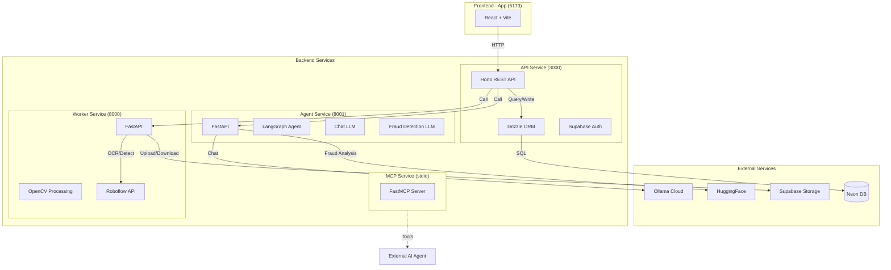
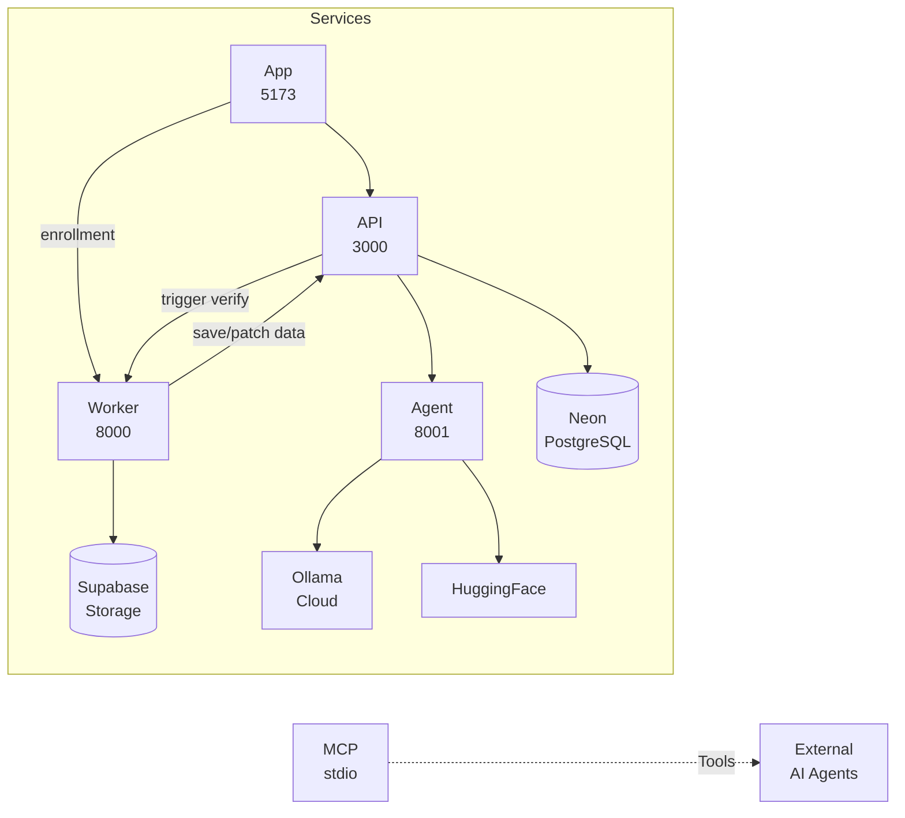
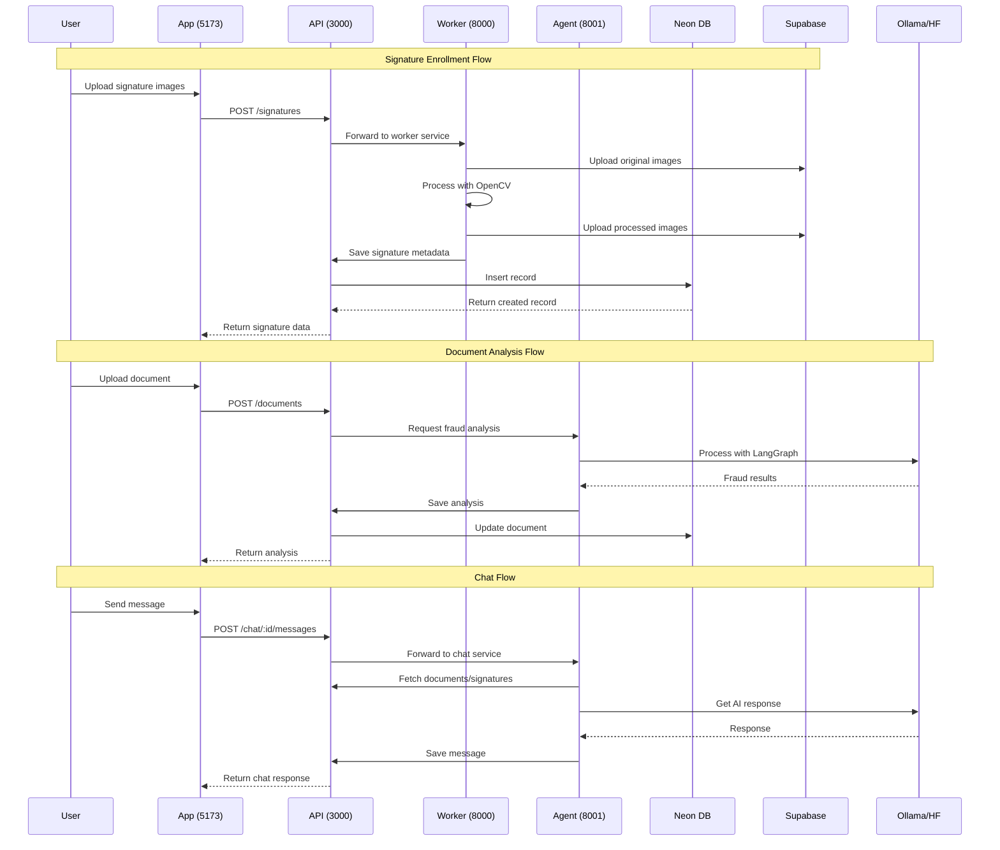
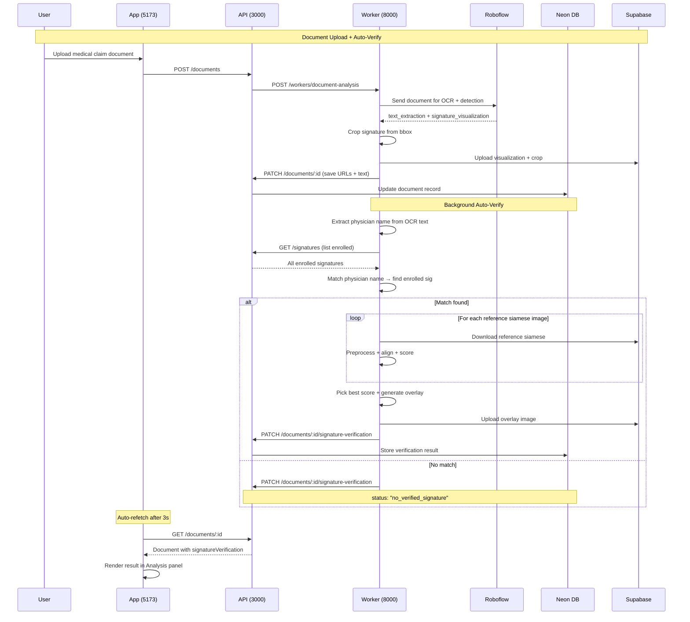
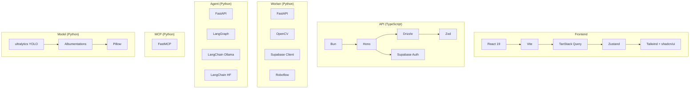

# Medcurial Architecture - High Level Overview

## System Architecture Diagram

## Service Connections Diagram

## Data Flow Diagram

## Signature Verification Flow

## Technology Stack Summary

