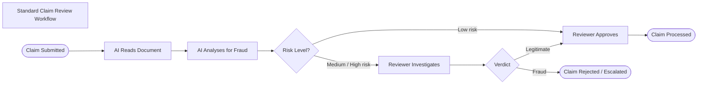
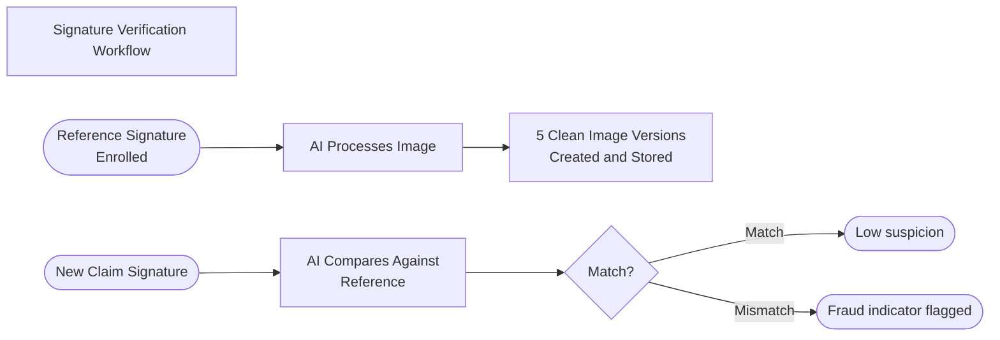
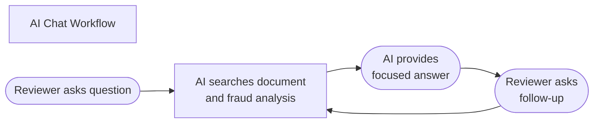

# Non-Technical Overview — Medcurial AI Claims Fraud Detection

---

## 1. What Is Medcurial AI Claims Fraud Detection?

**Medcurial AI Claims Fraud Detection** is a software system that helps insurance companies automatically detect potentially fraudulent medical claims before they are paid out.

When a person submits a medical insurance claim, they typically provide a paper form with their signature, medical details, and supporting documents. Fraudulent claims can include things like forged signatures, inflated bills, duplicate submissions, or fabricated treatments.

Medcurial AI reads these documents, analyses them using artificial intelligence, and produces a detailed fraud assessment report — highlighting any suspicious patterns for a human reviewer to act on.

---

## 2. The Problem It Solves

Medical insurance fraud is a significant financial and public health problem. Manual review of every claim is slow, expensive, and prone to human error. Fraudulent claims that go undetected lead to higher premiums for honest policyholders and financial losses for insurers.

Medcurial AI addresses this by:

- **Automating the first layer of fraud screening** — reducing the volume of claims that need manual review
- **Surfacing specific fraud indicators** — giving reviewers a focused, evidence-backed starting point
- **Creating an auditable trail** — every decision made in the system is recorded with a timestamp and attributed to the person who made it

---

## 3. Business Value

| Benefit | Description |
|---------|-------------|
| **Faster claim processing** | AI analysis completes in under 60 seconds, compared to hours or days for manual review |
| **Reduced fraud losses** | Early detection of high-risk claims reduces the number that are paid incorrectly |
| **Lower operational costs** | Investigators focus their time on high-risk cases rather than screening every submission |
| **Compliance and auditability** | Every action is timestamped and attributed, supporting regulatory audit requirements |
| **Scalable review capacity** | The system handles as many documents as needed without requiring proportional headcount increases |
| **Consistent analysis** | AI applies the same criteria to every claim, eliminating inconsistency from individual reviewer fatigue |

---

## 4. How the System Works (Plain English)

### Step 1 — A Claim is Submitted

An insurance claims officer uploads a scanned copy of the claim document into the Medcurial AI web portal.

### Step 2 — The System Reads the Document

The system uses **Optical Character Recognition (OCR)** — the same technology that turns a photo of text into editable text — to read all of the words and numbers on the document.

### Step 3 — AI Analyses for Fraud

The extracted text is passed through an AI pipeline that examines it for fraud patterns. Four specialised AI components work in sequence:

| AI Component | What It Does |
|--------------|-------------|
| **Formatter** | Organises the raw text into a clean, structured format |
| **Fraud Detector** | Decides whether the document looks fraudulent or legitimate |
| **Ranker** | Assigns a severity level to any fraud indicators found (Low / Medium / High / Critical) |
| **Auditor** | Writes a plain-English summary of the findings and the reasoning behind them |

### Step 4 — A Report is Generated

Within about 30–60 seconds, the system produces a **fraud analysis report** that includes:
- A fraud verdict (Fraud / Not Fraud)
- A confidence percentage
- A list of specific suspicious patterns found
- A plain-English explanation

### Step 5 — Human Reviewers Act on the Report

Two types of reviewers can then act on the report:

- **Claims Approval Reviewers** — Approve or reject the claim, with their reasoning recorded
- **Fraud Investigators** — Conduct a deeper investigation and record a final fraud verdict

### Step 6 — Everything is Recorded

All actions — approvals, rejections, investigation outcomes, and reviewer notes — are saved with timestamps and the name of the person who made each decision. This creates a complete, auditable history for every claim.

---

## 5. Key Workflows

### Workflow 1 — Standard Claim Review

**What this shows:** Most claims are automatically assessed as low-risk and can be approved quickly. High-risk claims are flagged for deeper investigation, concentrating specialist time where it is most needed.

---

### Workflow 2 — Signature Verification

Before reviewing a claim, the system can compare the signature on the document against a reference signature registered in the system for that claimant. This helps detect forged signatures.

**What this shows:** Reference signatures are stored securely. When a new claim arrives, the signature is compared against the reference. A mismatch is automatically flagged as a fraud indicator.

---

### Workflow 3 — AI Chat

Reviewers can have a conversation with the system's built-in AI assistant about any document. They can ask questions in plain English and get specific, relevant answers based on the document's content and fraud analysis.

**What this shows:** The AI chat remembers the entire conversation, allowing reviewers to explore a document interactively without having to re-read it manually.

---

## 6. Key Roles

| Role | What They Do |
|------|-------------|
| **Claims Reviewer (CAP)** | Reviews AI reports and makes approve/reject decisions on claims |
| **Fraud Investigator (FIU)** | Conducts deeper investigation on high-risk claims and records formal fraud verdicts |
| **System Administrator** | Manages user accounts and system configuration |

---

## 7. What the System Does NOT Do

To set clear expectations, it is important to understand the current scope:

| Out of Scope | Explanation |
|-------------|-------------|
| Final fraud decision | The AI produces a recommendation only. A human always makes the final call |
| Payment processing | The system does not process or block payments directly |
| Integration with core insurance systems | The system operates as a standalone portal |
| Mobile app | The system is accessible via a web browser only |
| Real-time document ingestion | Documents must be manually uploaded by a claims officer |

---

## 8. Summary

Medcurial AI Claims Fraud Detection is an intelligent assistant for insurance claims teams. It does not replace human judgement — it makes human reviewers faster, more consistent, and more effective by surfacing the right information at the right time.

By automatically screening every claim with AI and presenting structured findings, the system allows investigators to focus their expertise on the cases that matter most, reducing fraud losses and processing times simultaneously.
