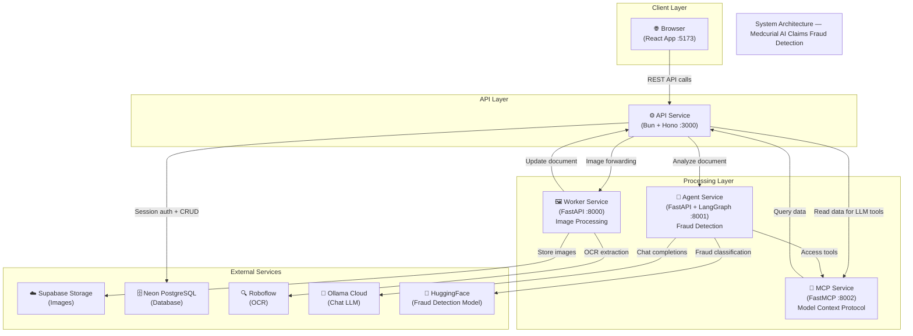
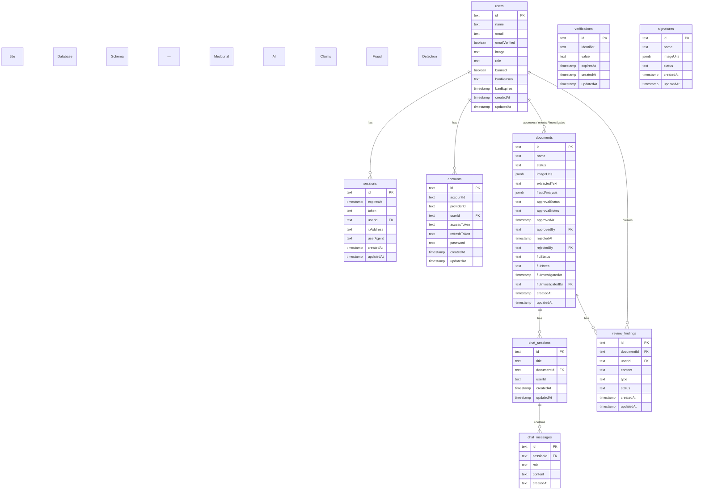
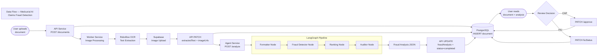
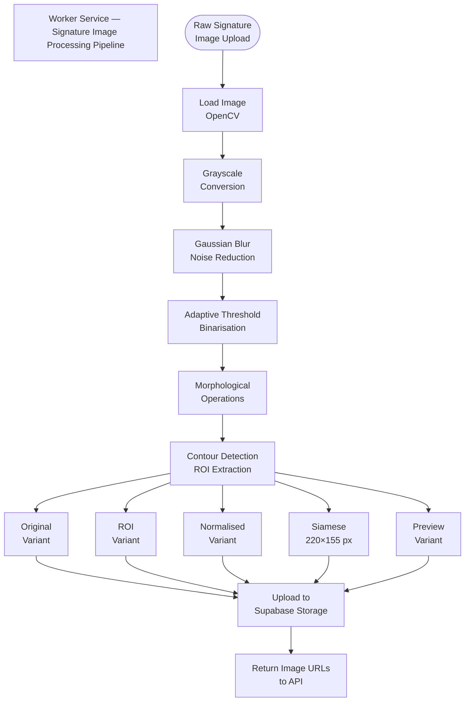

# Technical Documentation — Medcurial AI Claims Fraud Detection

---

## 1. System Architecture

Medcurial AI Claims Fraud Detection is built as a **multi-service architecture** where each service has a single responsibility. Services communicate over HTTP. The React frontend interacts exclusively with the API service. Backend services interact with each other and with external cloud providers.

### Diagram: System Architecture

**Explanation:**

- **Browser (App)** is the user-facing React application. All user actions go through the API service.
- **API Service** is the central hub. It orchestrates calls to Worker, Agent, and the database.
- **Worker Service** receives raw document/signature images, processes them with OpenCV, calls Roboflow for OCR, and uploads results to Supabase.
- **Agent Service** runs the LangGraph fraud detection pipeline and hosts the AI chat endpoint.
- **MCP Service** exposes documents and signatures as callable tools for LLM agents.
- **Neon PostgreSQL** stores all structured data (users, documents, signatures, chat, findings).
- **Supabase** stores all binary image assets.
- **Roboflow**, **Ollama Cloud**, and **HuggingFace** are external AI/ML providers.

---

## 2. Tech Stack

| Layer | Technology | Version | Purpose |
|-------|-----------|---------|---------|
| API Runtime | Bun | ≥1.0 | JavaScript runtime for the API |
| API Framework | Hono | 4.12.8 | Lightweight web framework |
| ORM | Drizzle ORM | 0.45.1 | Type-safe SQL query builder |
| Database | Neon (PostgreSQL) | 15+ | Relational data storage |
| Auth | Better Auth | 1.5.6 | Session-based authentication |
| Validation | Zod | 4.3.6 | Schema validation |
| Storage | Supabase | 2.x | Object storage for images |
| ID generation | nanoid | — | Short, URL-safe unique IDs |
| Frontend | React | 19.2.0 | UI framework |
| Frontend Build | Vite | 6.x | Dev server and bundler |
| Frontend Routing | TanStack Router | 1.167.3 | File-based client routing |
| Frontend Data | TanStack Query | 5.90.21 | Server state management |
| Frontend State | Zustand | 5.0.12 | Client state management |
| UI Components | shadcn/ui + Tailwind CSS | 4.x | Accessible component library |
| Python Runtime | Python | ≥3.12 | Worker, Agent, MCP services |
| Python Package Mgr | uv | — | Fast Python package manager |
| Worker Framework | FastAPI | ≥0.135.1 | Async Python web framework |
| Image Processing | OpenCV | 4.13.x | Computer vision pipeline |
| OCR | Roboflow API | — | Text extraction from images |
| AI Pipeline | LangGraph | ≥1.1.0 | Multi-node agent workflow |
| AI Framework | LangChain | ≥1.2.11 | LLM integration |
| Chat LLM | Ollama Cloud | — | Chat model hosting |
| Fraud LLM | HuggingFace (Qwen2.5-1.5B) | — | Fraud classification |
| MCP Framework | FastMCP | ≥3.1.1 | Model Context Protocol server |
| Containerisation | Docker + Docker Compose | — | Service orchestration |
| Linter (TS) | Biome | — | TypeScript linting/formatting |
| Linter (Python) | Ruff | ≥0.8.0 | Python linting/formatting |
| Type Checker (TS) | TypeScript | — | Static typing |
| Type Checker (Py) | mypy | ≥1.19.1 | Python static typing |

---

## 3. Core Modules / Components

### 3.1 API Service (`api/src/`)

| Module | File | Responsibility |
|--------|------|----------------|
| Entry point | `index.ts` | HTTP server bootstrap, middleware registration, route mounting |
| Authentication | `auth.ts` | Better Auth configuration (email/password, sessions, roles) |
| Database | `db.ts` | Drizzle ORM client and connection pool setup |
| Constants | `constants.ts` | Environment variable parsing and exported constants |
| Types | `types.ts` | Shared TypeScript types across the service |
| Routes — Signatures | `routes/signature.ts` | Signature CRUD handlers |
| Routes — Documents | `routes/document.ts` | Document CRUD, approval, findings, webhook callbacks |
| Routes — Chat | `routes/chat.ts` | Chat session and message handlers |
| Routes — Users | `routes/user.ts` | User profile handlers |
| Middleware — Auth | `middlewares/protected.ts` | Session token validation guard |
| Middleware — Logger | `middlewares/logger.ts` | Structured request/response logging |
| Middleware — Error | `middlewares/error.ts` | Global error handler |
| Schemas | `schemas/*.ts` | Drizzle ORM table definitions |
| Migrations | `migrations/*.sql` | Versioned database schema migrations |

### 3.2 Worker Service (`worker/app/`)

| Module | File | Responsibility |
|--------|------|----------------|
| Entry point | `main.py` | FastAPI app initialisation and router registration |
| Configuration | `config.py` | Environment variable loading |
| Dependencies | `dependencies.py` | FastAPI dependency injection definitions |
| Exceptions | `exceptions.py` | Custom exception classes |
| Router | `routers/worker.py` | `POST /workers/enroll-signature` endpoint |
| Schemas | `schemas/worker.py` | Pydantic request/response models |
| Signature Processor | `services/signature_processor.py` | OpenCV image processing pipeline |
| Signature Analyser | `services/signature_analyzer.py` | Siamese network image preparation |
| Storage | `services/storage.py` | Supabase upload/download operations |
| API Client | `services/api_client.py` | HTTP client for calling the API service |
| Roboflow | `services/roboflow.py` | OCR extraction via Roboflow API |
| Utilities | `services/utils.py` | Shared helpers |

### 3.3 Agent Service (`agent/src/`)

| Module | File | Responsibility |
|--------|------|----------------|
| Entry point | `main.py` | FastAPI app initialisation |
| Configuration | `config.py` | LLM model selection and environment config |
| Graph | `graph.py` | LangGraph workflow definition and compilation |
| State | `state.py` | Typed graph state definition |
| MCP Client | `mcp_client.py` | Connection to MCP service |
| Node — Formatter | `nodes/formatter.py` | Formats raw OCR text |
| Node — Fraud Detector | `nodes/fraud_detector.py` | HuggingFace model classification |
| Node — Ranking | `nodes/ranking.py` | Assigns severity ranking |
| Node — Auditor | `nodes/auditor.py` | Produces final audit summary |
| Router — Agent | `routers/agent.py` | `POST /analyze` endpoint |
| Router — Chat | `routers/chat.py` | `POST /chat` endpoint |
| Tools — Data | `tools/data_tools.py` | LangChain tools for data access |
| Prompts | `prompts/*.md` | System prompts for each LLM node |

### 3.4 MCP Service (`mcp/main.py`)

| Tool | Description |
|------|-------------|
| `query_documents()` | Returns a paginated list of documents |
| `get_document(id)` | Returns a single document by ID |
| `get_fraud_analysis(id)` | Returns the fraud analysis object for a document |
| `query_signatures()` | Returns a paginated list of signatures |

### 3.5 App (`app/src/`)

| Module | Path | Responsibility |
|--------|------|----------------|
| Routes | `routes/` | TanStack Router page components |
| Features | `features/` | Domain-grouped feature modules (signatures, documents, chat, auth, review, tasks) |
| UI Components | `components/ui/` | shadcn/ui base components |
| State | `store/useStore.ts` | Zustand global state |

---

## 4. Database Design

### Diagram: Entity Relationship Diagram

**Explanation:**

- **users** is the central identity table. All roles and ban status live here.
- **sessions / accounts / verifications** are Better Auth tables managing tokens and OAuth providers.
- **signatures** stores processed signature metadata and Supabase image URL sets per signatory.
- **documents** is the core business entity storing OCR text, fraud analysis JSON, and dual workflow states (CAP approval + FIU investigation).
- **chat_sessions** links conversations to an optional document context; messages are stored in **chat_messages**.
- **review_findings** records structured reviewer notes (type = `fiu` or `cap`) against a document.

---

## 5. External Integrations

| Integration | Service | Usage |
|-------------|---------|-------|
| Supabase Storage | Cloud object store | Persists all processed signature and document images |
| Neon PostgreSQL | Managed PostgreSQL | Primary relational database |
| Roboflow | OCR API | Extracts text from document images |
| Ollama Cloud | LLM hosting | Powers chat completions (minimax-2.5, minimax-2.7, cogito-2.1, gemini-flash, kimi-k2.5) |
| HuggingFace | Model inference | Runs Qwen2.5-1.5B for fraud classification |

---

## 6. Data Flow Diagram

### Diagram: End-to-End Data Flow

**Explanation:**

1. A user uploads a document via the browser.
2. The API creates a pending record in PostgreSQL and forwards the image to the Worker.
3. The Worker extracts text using Roboflow OCR and uploads all images to Supabase.
4. The Worker patches the document record with extracted text and image URLs.
5. The API sends the extracted text to the Agent Service.
6. The Agent runs a four-node LangGraph pipeline: Formatter → Fraud Detector → Ranking → Auditor.
7. The resulting fraud analysis JSON is written back to the document record.
8. Reviewers read the document and make CAP (approval) or FIU (investigation) decisions.
9. All decisions are persisted to PostgreSQL.

---

## 7. Image Processing Pipeline

### Diagram: OpenCV Signature Processing Pipeline

**Explanation:**

Each uploaded signature image is processed into five variants:
- **Original** — The raw input image as received.
- **ROI (Region of Interest)** — Cropped to the signature bounding box after contour detection.
- **Normalised** — Standardised brightness and contrast applied to the ROI.
- **Siamese** — Resized to exactly 220×155 pixels for use with the Siamese neural network comparator.
- **Preview** — A display-optimised version for the UI thumbnail.

All variants are uploaded to Supabase under `signatures/processed/{signatory_name}/{type}/`.
