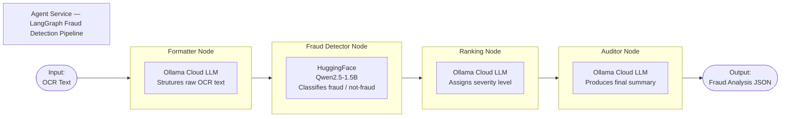
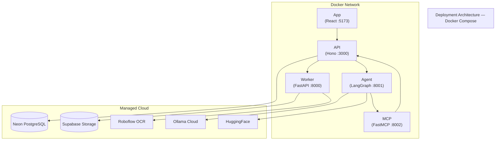

# Technical Overview — Medcurial AI Claims Fraud Detection

---

## 1. High-Level Technical Summary

Medcurial AI Claims Fraud Detection is a **cloud-native, AI-augmented fraud detection platform** built for medical insurance claims processing. It is structured as five independently deployable microservices that communicate over HTTP, backed by managed cloud infrastructure for data storage and AI inference.

The platform ingests scanned claim documents and signature images, processes them through computer vision and OCR pipelines, applies a multi-node LLM-based fraud analysis workflow, and surfaces findings through a role-based web interface with structured approval and investigation workflows.

---

## 2. System Design Summary

### Architecture Pattern

The system uses a **layered microservices architecture**:

| Layer | Services | Responsibility |
|-------|----------|----------------|
| Presentation | App (React) | User interface, routing, state |
| Orchestration | API (Hono) | Request routing, auth, DB access, inter-service calls |
| Processing | Worker (FastAPI) | Image processing, OCR, storage |
| Intelligence | Agent (LangGraph) | AI fraud analysis, chat |
| Integration | MCP (FastMCP) | LLM tool access to system data |

### Communication Model

- **Synchronous HTTP** — All service-to-service calls use HTTP/REST. The API service is the hub; Worker and Agent are called as subordinate services.
- **Callback pattern** — Worker processes images asynchronously and patches results back to the API via a callback endpoint.
- **No message queue** — The current architecture is synchronous throughout. Horizontal scaling is achieved by running multiple container instances.

### Data Architecture

- **PostgreSQL (Neon)** is the single source of truth for all structured data: users, sessions, documents, signatures, chat, and findings.
- **Supabase Storage** holds all binary image assets. The database stores only public URLs to these assets.
- **JSONB columns** (`fraudAnalysis`, `imageUrls`) allow flexible, schema-less data to be stored alongside structured relational data without a separate document store.

### AI Pipeline Architecture

The fraud detection pipeline is implemented as a **LangGraph directed acyclic graph (DAG)**:

Each node receives the full pipeline state, performs one transformation, and returns a partial state update. This design makes nodes independently testable and replaceable.

---

## 3. Key Technical Decisions and Trade-Offs

### Decision 1: Bun + Hono for the API

**Chosen:** Bun runtime with Hono web framework  
**Alternatives considered:** Node.js + Express, Deno + Hono, Node.js + Fastify

**Rationale:**
- Bun provides significantly faster startup and execution times than Node.js for I/O-bound workloads
- Hono is lightweight, type-safe, and has excellent Bun support
- Bun's built-in test runner, bundler, and package manager reduce toolchain complexity

**Trade-off:**
- Bun is newer than Node.js and has a smaller ecosystem. Some Node.js packages require compatibility shims.

---

### Decision 2: Python for Processing / AI Services

**Chosen:** Python 3.12 with FastAPI for Worker, Agent, and MCP services  
**Alternatives considered:** TypeScript-native ML libraries, Go for Worker

**Rationale:**
- Python has the dominant ecosystem for computer vision (OpenCV), ML (HuggingFace, LangChain), and AI workflows (LangGraph)
- FastAPI offers high performance with async support and automatic OpenAPI documentation
- uv provides fast, reproducible Python dependency management

**Trade-off:**
- Running Python and TypeScript services means developers need familiarity with both ecosystems. Cross-service debugging is more complex.

---

### Decision 3: LangGraph for the AI Pipeline

**Chosen:** LangGraph with a fixed four-node DAG  
**Alternatives considered:** Sequential LangChain chain, custom orchestration loop

**Rationale:**
- LangGraph provides a structured, inspectable, and resumable graph-based workflow
- State is typed and shared across nodes, making the pipeline auditable
- Individual nodes can be replaced or extended without restructuring the pipeline

**Trade-off:**
- LangGraph introduces a learning curve compared to a simple sequential chain
- Current implementation is a linear DAG — conditional branching (e.g., skip Ranking if not fraud) is not yet implemented

---

### Decision 4: Supabase for Storage

**Chosen:** Supabase Storage  
**Alternatives considered:** AWS S3, Cloudflare R2, local filesystem

**Rationale:**
- Supabase provides S3-compatible storage with a simple JavaScript client and public URL generation
- Integrates with the existing Supabase account used for the project
- No infrastructure management required

**Trade-off:**
- Vendor lock-in to Supabase. Migrating to S3 would require changing `storage.py` and updating URL formats.

---

### Decision 5: JSONB for Fraud Analysis Storage

**Chosen:** PostgreSQL JSONB column for `fraudAnalysis`  
**Alternatives considered:** Separate `fraud_analyses` table, separate document store (MongoDB)

**Rationale:**
- The fraud analysis schema may evolve as the AI pipeline matures. JSONB allows flexibility without a migration for every schema change.
- Keeps the document and its analysis co-located in a single row, simplifying queries.

**Trade-off:**
- JSONB fields are not type-safe at the database level. Application code must validate the structure on read.

---

### Decision 6: Better Auth for Authentication

**Chosen:** Better Auth library  
**Alternatives considered:** Auth0, Clerk, custom JWT implementation

**Rationale:**
- Better Auth is an open-source, self-hosted authentication library with first-class Hono and Bun support
- Provides session management, email/password auth, role assignment, and user banning out of the box
- No third-party SaaS dependency for authentication

**Trade-off:**
- Self-hosted authentication requires the team to manage session security and token rotation. Managed services (Auth0, Clerk) would reduce this burden.

---

## 4. Security Architecture

| Concern | Mechanism |
|---------|-----------|
| Authentication | Session tokens via Better Auth |
| Authorisation | Role-based middleware (`protected` guard) |
| Secrets management | Environment variables; never committed to source control |
| Image storage | Supabase Storage with public read URLs (no PII in image paths) |
| Database | Neon managed PostgreSQL with connection-string based access |
| Service isolation | Each service runs in its own Docker container; no direct cross-service database access |

---

## 5. Deployment Architecture

**Explanation:** All five services run as Docker containers within a shared Docker Compose network. They communicate by service name. All persistent state and AI inference are delegated to external managed cloud providers, making the container layer stateless and horizontally scalable.

---

## 6. Scalability Considerations

| Concern | Current Approach | Future Path |
|---------|-----------------|-------------|
| API throughput | Single container | Horizontal scaling with load balancer |
| Document processing | Synchronous per request | Async job queue (e.g., BullMQ, Celery) |
| AI inference latency | Synchronous LangGraph execution | Streaming responses, pipeline caching |
| Database | Neon serverless (auto-scales) | Read replicas for high query load |
| Storage | Supabase (managed) | CDN distribution for image delivery |

---

## 7. Observability

| Service | Logging | Health Check |
|---------|---------|-------------|
| API | Structured HTTP request logs via Hono middleware | `GET /health` |
| Worker | FastAPI standard access logs | `GET /health` |
| Agent | FastAPI standard access logs | `GET /health` |
| MCP | loguru structured logging | N/A (stdio transport) |
| App | Browser console + React error boundaries | N/A |

All Docker Compose services are configured with health checks to enable dependency-ordered startup and readiness probing.
