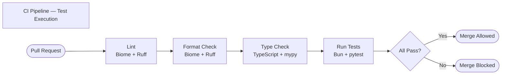

# Testing Documentation — Medcurial AI Claims Fraud Detection

---

## 1. Testing Strategy

Medcurial AI Claims Fraud Detection uses a layered testing approach that prioritises reliability of the API layer and Python service logic. Given the multi-service architecture, tests are organised per service and can be run independently.

| Testing Layer | Goal |
|---------------|------|
| **Unit tests** | Verify individual functions and modules in isolation |
| **Integration tests** | Verify that services interact correctly with the database and external APIs (using mocks or test doubles) |
| **End-to-end (E2E) tests** | Verify complete user workflows through the running system |
| **Type checking** | Catch type errors at build time using TypeScript and mypy |
| **Linting** | Enforce code style and catch common bugs statically |

---

## 2. Test Types

### 2.1 Unit Tests

Unit tests target individual functions and classes without external dependencies. They are fast and run on every change.

**Targets:**
- Image processing utility functions (Worker)
- LangGraph node logic (Agent)
- Validation schemas (API)
- Utility helpers across all services

### 2.2 Integration Tests

Integration tests verify the interaction between components: API routes and the database, the Worker service and Supabase, or the Agent and LangGraph pipeline.

**Targets:**
- API endpoints with a test database
- Worker image pipeline with mock Supabase storage
- Agent LangGraph pipeline with mock LLM responses

### 2.3 Type Checking (Static Analysis)

Type checking is treated as a form of automated testing. It catches contract violations between modules at development time.

| Service | Tool | Command |
|---------|------|---------|
| API | TypeScript `tsc` | `bun run typecheck` |
| App | TypeScript `tsc` | `bun run typecheck` |
| Worker | mypy | `uv run mypy .` |

### 2.4 Linting (Static Analysis)

Linters enforce coding standards and catch common bugs.

| Service | Tool | Command |
|---------|------|---------|
| API | Biome | `bun run lint` |
| App | ESLint | `bun run lint` |
| Worker | Ruff | `uv run ruff check .` |
| Agent | Ruff | `uv run ruff check .` |
| MCP | Ruff | `uv run ruff check .` |

---

## 3. Tools Used

| Tool | Ecosystem | Purpose |
|------|-----------|---------|
| [Bun Test](https://bun.sh/docs/cli/test) | TypeScript | Built-in test runner for Bun projects |
| [pytest](https://docs.pytest.org/) | Python | Test framework for Worker and Agent |
| [pytest-asyncio](https://pytest-asyncio.readthedocs.io/) | Python | Async test support |
| [httpx](https://www.python-httpx.org/) | Python | HTTP client for testing FastAPI endpoints |
| [TypeScript](https://www.typescriptlang.org/) | TypeScript | Static type checking |
| [mypy](https://mypy.readthedocs.io/) | Python | Static type checking |
| [Biome](https://biomejs.dev/) | TypeScript | Linting and formatting |
| [Ruff](https://docs.astral.sh/ruff/) | Python | Linting and formatting |

---

## 4. How to Run Tests

### 4.1 API — All Tests

```bash
cd api
bun test
```

### 4.2 API — Single Test File

```bash
cd api
bun test test/signature.test.ts
```

### 4.3 Worker — All Tests

```bash
cd worker
uv run pytest
```

### 4.4 Worker — Specific Test

```bash
cd worker
uv run pytest tests/test_signature_processor.py::test_grayscale_conversion
```

### 4.5 Worker — With Verbose Output

```bash
cd worker
uv run pytest -v
```

### 4.6 Worker — With Coverage Report

```bash
cd worker
uv run pytest --cov=app --cov-report=term-missing
```

### 4.7 Agent — Linting (no test suite yet)

```bash
cd agent
uv run ruff check .
uv run ruff format --check .
```

### 4.8 App — Type Checking and Linting

```bash
cd app
bun run typecheck
bun run lint
```

### 4.9 Run All Verification Checks (All Services)

```bash
# API
cd api && bun run lint && bun run format && bun run typecheck && bun test

# Worker
cd ../worker && uv run ruff check . && uv run ruff format --check . && uv run mypy . && uv run pytest

# Agent
cd ../agent && uv run ruff check . && uv run ruff format --check .

# App
cd ../app && bun run lint && bun run format && bun run typecheck

# MCP
cd ../mcp && uv run ruff check . && uv run ruff format --check .
```

---

## 5. Test File Conventions

### TypeScript (API)

- Test files are located in `api/test/`
- File naming: `<module>.test.ts`
- Uses Bun's built-in test runner

```typescript
// api/test/signature.test.ts
import { describe, it, expect, beforeAll } from 'bun:test';

describe('Signature Routes', () => {
  it('should return 200 for GET /signatures', async () => {
    const res = await fetch('http://localhost:3000/signatures', {
      headers: { Authorization: 'Bearer test-token' },
    });
    expect(res.status).toBe(200);
  });
});
```

### Python (Worker, Agent)

- Test files are located in `tests/`
- File naming: `test_<module>.py`
- Uses pytest with asyncio support

```python
# worker/tests/test_signature_processor.py
import pytest
from app.services.signature_processor import SignatureProcessor

def test_grayscale_conversion():
    processor = SignatureProcessor()
    result = processor.to_grayscale(sample_image)
    assert result.shape[-1] == 1  # Single channel

@pytest.mark.asyncio
async def test_enroll_signature_endpoint(client):
    response = await client.post(
        "/workers/enroll-signature",
        params={"signatory_name": "John Doe"},
        files={"file": open("tests/fixtures/sample_sig.png", "rb")},
    )
    assert response.status_code == 200
```

---

## 6. Sample Test Cases

### 6.1 API — Signature CRUD

| Test Case | Method | Endpoint | Expected Status |
|-----------|--------|----------|-----------------|
| List all signatures | GET | `/signatures` | 200 |
| Get signature by ID | GET | `/signatures/:id` | 200 |
| Get non-existent signature | GET | `/signatures/invalid` | 404 |
| Create signature | POST | `/signatures` | 201 |
| Create signature (missing name) | POST | `/signatures` | 400 |
| Update signature | PUT | `/signatures/:id` | 200 |
| Delete signature | DELETE | `/signatures/:id` | 200 |

### 6.2 API — Document Workflows

| Test Case | Method | Endpoint | Expected Status |
|-----------|--------|----------|-----------------|
| List documents | GET | `/documents` | 200 |
| Get document with fraud analysis | GET | `/documents/:id` | 200 |
| Create document | POST | `/documents` | 201 |
| Approve document | PATCH | `/documents/:id/approve` | 200 |
| Reject document (with notes) | PATCH | `/documents/:id/approve` | 200 |
| Add FIU finding | POST | `/documents/:id/findings` | 201 |

### 6.3 API — Authentication

| Test Case | Expected Behaviour |
|-----------|-------------------|
| Access protected route without token | Returns 401 |
| Access protected route with expired token | Returns 401 |
| Access protected route with valid token | Returns 200 |
| Login with valid credentials | Returns session token |
| Login with invalid password | Returns 401 |

### 6.4 Worker — Image Processing

| Test Case | Expected Behaviour |
|-----------|-------------------|
| Valid JPEG signature upload | Returns 5 processed image URLs |
| Valid PNG signature upload | Returns 5 processed image URLs |
| Upload with no signature region detected | Returns error or fallback image |
| Siamese output dimensions | Image is exactly 220×155 pixels |

### 6.5 Agent — LangGraph Pipeline

| Test Case | Expected Behaviour |
|-----------|-------------------|
| Formatter node with valid OCR text | Returns structured formatted text |
| Fraud detector with high-risk text | Returns `is_fraud: true` |
| Fraud detector with clean text | Returns `is_fraud: false` |
| Ranking node | Returns a valid risk level (`low`/`medium`/`high`/`critical`) |
| Auditor node | Returns a non-empty summary string |
| Full pipeline execution | Returns complete fraud analysis JSON |

---

## 7. CI Pipeline

Tests and checks are automatically run on every pull request via GitHub Actions.



**Explanation:** Every pull request triggers a sequential pipeline. If any step fails — linting, formatting, type checking, or tests — the merge is blocked. This ensures code quality and correctness are maintained across all contributions.
