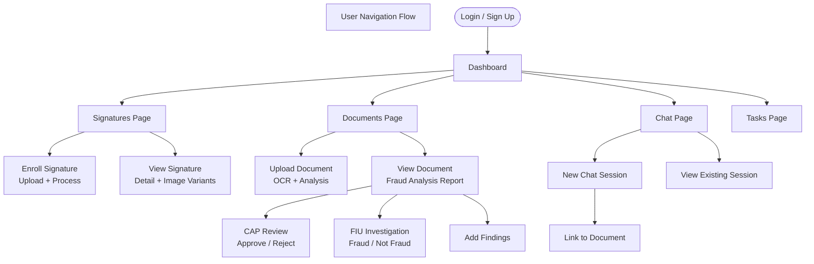

# User Documentation — Medcurial AI Claims Fraud Detection

---

## 1. Target Users

| User Type | Description |
|-----------|-------------|
| **Claims Reviewer (CAP)** | Insurance staff responsible for approving or rejecting submitted claims after reviewing AI-generated fraud analysis |
| **Fraud Investigator (FIU)** | Specialist investigators who perform deeper fraud investigation and give a final fraud verdict |
| **System Administrator** | Technical users who manage accounts, user roles, and system configuration |
| **AI Operator** | Power users who interact with the system through the AI chat interface to explore documents and fraud findings |

---

## 2. Key Features

| Feature | Description |
|---------|-------------|
| **Signature Enrollment** | Upload and manage reference handwritten signatures for claimants |
| **Document Processing** | Submit claim documents for automated OCR text extraction and fraud analysis |
| **Fraud Analysis Report** | View AI-generated reports identifying fraud indicators, risk level, and summary |
| **Claims Approval (CAP)** | Approve or reject claims with notes and a full audit trail |
| **Fraud Investigation (FIU)** | Record fraud verdicts with supporting findings and investigation notes |
| **AI Chat** | Ask natural language questions about any document using the built-in AI assistant |
| **Task Dashboard** | Track the status of in-progress document reviews |

---

## 3. How to Use the System

### 3.1 Logging In

1. Open the Medcurial AI Claims Fraud Detection web application in your browser.
2. Click **Sign In** on the login page.
3. Enter your **email address** and **password**.
4. Click **Sign In**. You will be redirected to the main dashboard.

> If you do not have an account, click **Sign Up** and complete the registration form.

---

### 3.2 Enrolling a Signature

Use this workflow to register reference signatures for a claimant before or after submitting their claim document.

1. From the left sidebar, click **Signatures**.
2. Click **Enroll Signature**.
3. Enter the **signatory's full name** in the name field.
4. Upload one or more signature images (JPEG or PNG recommended).
5. Click **Submit**. The system will show a processing spinner while it runs the image pipeline.
6. Once processing is complete, the signature card will appear in the Signatures list with a **Completed** status badge.
7. Click on any signature card to view all five processed image variants: Original, ROI, Normalised, Siamese, and Preview.

> **Tip:** Upload at least three samples of the same signatory's signature for better comparison accuracy.

---

### 3.3 Submitting a Document for Analysis

1. From the left sidebar, click **Documents**.
2. Click **Upload Document**.
3. Enter a **document name** (e.g., `Claim-2026-001`).
4. Upload the scanned claim document image(s).
5. Click **Submit**. The document will appear in the list with a **Processing** status.
6. Wait for the system to complete OCR extraction and fraud analysis (typically 20–60 seconds).
7. When the status changes to **Completed**, click the document to view the fraud analysis report.

---

### 3.4 Reading the Fraud Analysis Report

After a document is processed, its detail page shows:

| Section | What It Shows |
|---------|---------------|
| **Fraud Verdict** | Whether the AI considers the document fraudulent (`Fraud` / `Not Fraud`) |
| **Confidence Score** | AI confidence level (0–100%) |
| **Risk Level** | `Low`, `Medium`, `High`, or `Critical` |
| **Findings** | List of specific fraud indicators detected |
| **Summary** | A plain-English narrative explaining the AI's reasoning |
| **Extracted Text** | The raw OCR text extracted from the document |

---

### 3.5 Reviewing a Document (Claims Approval Process — CAP)

The CAP workflow is for authorised claims reviewers to make an approval decision.

1. Open a completed document from the Documents list.
2. Review the AI fraud analysis report and any existing findings.
3. Click **Review (CAP)** to open the Claims Approval panel.
4. Enter **review notes** explaining your decision.
5. Click **Approve** or **Reject**.
6. The document's Approval Status will update to **Approved** or **Rejected**, and the action is timestamped against your account.

---

### 3.6 Conducting a Fraud Investigation (FIU)

The FIU workflow is for fraud investigators to record a formal verdict.

1. Open a completed document from the Documents list.
2. Review the AI analysis, CAP notes, and existing findings.
3. Click **Investigate (FIU)** to open the Fraud Investigation panel.
4. Select your verdict: **Fraud** or **Not Fraud**.
5. Enter detailed **investigation notes**.
6. Click **Submit**. The document's FIU Status will update accordingly.

---

### 3.7 Adding Review Findings

Any authorised user can attach structured findings to a document to support the review process.

1. Open a document's detail page.
2. Scroll to the **Findings** section.
3. Click **Add Finding**.
4. Enter your finding text.
5. Select the finding type: **CAP** (claims) or **FIU** (investigation).
6. Optionally set a status flag: `fraud`, `not_fraud`, `approved`, or `rejected`.
7. Click **Save**. The finding is saved with your name and a timestamp.

---

### 3.8 Using the AI Chat

The AI Chat lets you ask questions about any document in natural language.

1. From the left sidebar, click **Chat**.
2. Click **New Chat**.
3. Optionally, link the chat to a specific document by selecting it from the dropdown.
4. Type your question in the message box and press **Enter** (or click Send).
5. The AI will respond using context from the linked document and fraud analysis.
6. Continue the conversation as needed. The full history is saved automatically.

**Example questions you can ask:**
- *"What are the top fraud indicators for this claim?"*
- *"Summarise the extracted text in plain English."*
- *"Does the signature on page 2 match the enrolled reference?"*
- *"What is the risk level and why?"*

---

### 3.9 Managing Tasks

The Tasks page gives an overview of all documents currently requiring action.

1. From the left sidebar, click **Tasks**.
2. The task list shows all documents grouped by their review status.
3. Click any task to go directly to that document's detail page.

---

## 4. Screen and Flow Summary

**Explanation:** This flow diagram shows the primary navigation paths available to a user after logging in. Reviewers will spend most of their time on the Documents branch, while investigators will use the FIU path. The Chat feature is available from anywhere in the application.

---

## 5. FAQs / Common Issues

### Q: How long does document processing take?
**A:** OCR extraction and fraud analysis typically take between 20 and 60 seconds depending on document complexity and AI service availability. You can leave the page and return — the status will update automatically.

---

### Q: The document status is stuck on "Processing". What should I do?
**A:** Wait up to 2 minutes. If the status does not change, contact your system administrator. The processing may have failed due to a network or AI service error. The administrator can re-trigger processing from the back end.

---

### Q: Can I upload multiple pages of a claim in one document?
**A:** Yes. You can upload multiple image files when creating a document. All pages will be processed and analysed together.

---

### Q: What image formats are supported?
**A:** JPEG (`.jpg`, `.jpeg`) and PNG (`.png`) are recommended. Ensure scans are at 150 DPI or higher for best OCR accuracy.

---

### Q: My signature enrollment shows "Failed". What happened?
**A:** The image processing pipeline could not extract a clean signature region. Try uploading a higher-quality scan of the signature, ensuring the signature is on a plain white background with no overlapping text.

---

### Q: Can I change a fraud verdict after submitting it?
**A:** The system records all decisions with timestamps. If an error was made, contact your system administrator, who can update the record directly.

---

### Q: What LLM models does the chat use?
**A:** The chat supports multiple Ollama Cloud models: `minimax-2.5`, `minimax-2.7`, `cogito-2.1`, `gemini-flash`, and `kimi-k2.5`. The active model is configured by your system administrator.

---

### Q: Who can see my chat history?
**A:** Chat sessions are private to the user who created them. Administrators with database access can view all sessions.

---

### Q: I cannot log in. What should I do?
**A:** Check your email and password. If you have forgotten your password, use the **Forgot Password** link on the login page. If you are still unable to log in, contact your system administrator — your account may have been suspended.
